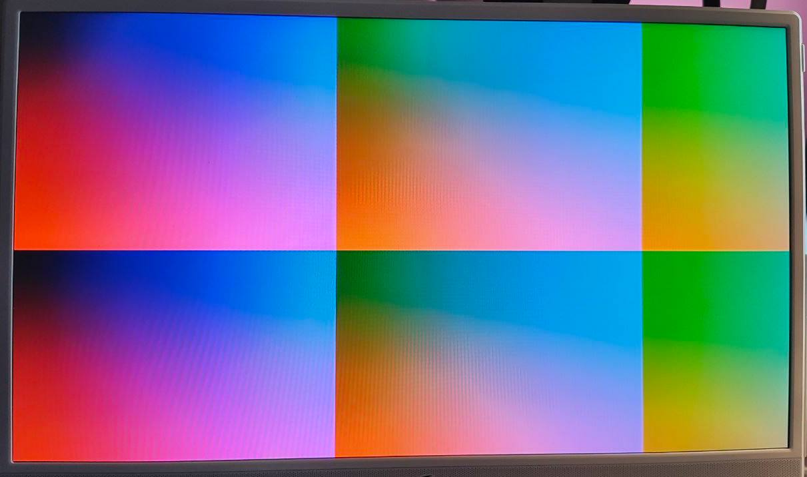

Title: Implementing DDMI/DVI-on-an-HDMI-connector video output on a Lakritz ECP5 FPGA board
Date: 2024-12-22

This is a strange note; my Verilog module file was more-than-half comment lines,
so I "inverted" it and turned it into an .md file with less-than-half of it being code snippets.

Articles exist on the Internet about this topic, but I wished they explained more
of the "why", not only the "how".

I am not proficient at neither Verilog nor video standards. Please [email me](https://github.com/parport0/) if something is wrong and irks you.

### DDMI stands for "Differential Data Multiple Interface".

The connector on the board is an HDMI connector.

The signals I send are DVI signals.

[DDMI](https://github.com/machdyne/ddmi) is different from, for example, GPDI (General-Purpose Differential Interface)
seen on [other boards](https://github.com/emard/ulx3s), and surely different from HDMI.

DDMI only has the R, G, B, and clock diffpairs connected, other pins (CEC, the
I2C clock and data, Hot Plug Detect, and the Utility pin used for Ethernet and
ARC) are [left to float](https://github.com/machdyne/lakritz/blob/main/pcb/lakritz_v0.pdf).
(I think GPDI [connects all of those to your chip](https://github.com/emard/ulx3s/blob/master/doc/schematics_v316.pdf) instead)

But all that is superficial as we can still send DVI signals using the DDMI
interface, and they should be read properly even by "HDMI-capable"
displays (or you can use an HDMI to DVI adapter / cable).
HDMI is somewhat based / closely related to DVI.

The [DVI specification](https://web.archive.org/web/20070226204801if_/http://www.ddwg.org:80/lib/dvi_10.pdf)
is legally available online. The Digital Display Working
Group website is down, but the Internet Archive remembers.

The signal has to be DVI-D to be compatible with HDMI devices (and connectors);
that's because DVI-D is the only digital-only flavor, other variants --- DVI-A
and DVI-I have analog lines.

The signal has to be "single-link" DVI to be compatible with the standard
(non-dual-link) HDMI connector we have on the board.

Single-link DVI-D has four "TMDS twisted pairs": R, G, B, and clock.  At a
point in time one pixel is transmitted with its R, G, and B values encoded as
10-bit integers. Pixels are being transmitted from left to right, from top to
bottom. DVI was made that way to keep compatibility with CRT displays.

### Electrical details for my board

First things first, voltage.

The HDMI connector must have 5 volts on the +5V pin.

But the data pins, by the DVI specification, are only supposed to transmit
between `AV_cc` = +3.3V and `AV_cc - V_swing`, where `V_swing` is specified
to be around 0.5V.

My .lpf file specifies the "P" pins only, leaving out the "N" pins.
This does not mean that the "N" pins aren't driven. I use `IO_TYPE=LVCMOS33D`,
which means that the "N" pins are driven by Lattice auto-magic
(the FPGA just *supports* differential signalling).

```
LOCATE COMP "ddmi_clk_p" SITE "L1";
LOCATE COMP "ddmi_d0_p"  SITE "M1";
LOCATE COMP "ddmi_d1_p"  SITE "R2";
LOCATE COMP "ddmi_d2_p"  SITE "R4";
IOBUF  PORT "ddmi_clk_p" IO_TYPE=LVCMOS33D DRIVE=4;
IOBUF  PORT "ddmi_d0_p"  IO_TYPE=LVCMOS33D DRIVE=4;
IOBUF  PORT "ddmi_d1_p"  IO_TYPE=LVCMOS33D DRIVE=4;
IOBUF  PORT "ddmi_d2_p"  IO_TYPE=LVCMOS33D DRIVE=4;
```

But won't this also mean that I send 0V ~ +3.3V instead of +2.7V ~ +3.3V?
Yes, I believe it will.
ECP5 does not support any special "TMDS" IO types.

I do not understand why exactly this works, why this is allowed to work
(does, maybe, HDMI allow it?), why this does not burn any displays
(it did not burn any of mine)
and why the schematic has no capacitors breaking up the TMDS lines
(something I've seen being suggested on the forums, and, for example,
implemented on the "ULX3S" board), there are only 270 Ohm resistor arrays there.

but it works,

and it is what Lone Dynamics also specified [when they added Lakritz support to LiteX](https://github.com/litex-hub/litex-boards/commit/34e85c5cf699f0ee67fe8de4f64ff01f15ce244f#diff-58c38e81366e0b19aaefd17832b4088de53dac28ba1f8957036ceae923ca7a8eR37).

This module takes two clocks in, because fitting all the logic into the clk_tmds clock was not possible for my board.
For me, they come from the same PLL.

```
module ddmi (
	input clk_tmds,
	input clk_pixel,
	output ddmi_clk_p,
	output ddmi_d0_p,
	output ddmi_d1_p,
	output ddmi_d2_p
	);
```

### Display modes standards

The amount and timing of sending the pixels are specified by
display modes. Both the DVI video format (and the HDMI video format),
still use the same concept of display modes from the CRT times,
with front porches, back porches, vsync and hsync intervals.

A lot of different display modes exist, and a lot of standards
attempt(ed) to specify or document them; one can refer to, for
example, the following [open documents from VESA](https://vesa.org/vesa-standards/):

* VESA DMT 1.0 rev. 13 (VESA and Industry Standards and Guidelines for
  Computer Display Monitor Timing), which is an old document
  trying to list and document some modes.
* VESA GTF 1.1 (Generalized Timing Formula Standard), attempting
  to give a formula for calculating parameters for display modes
* VESA CVT 1.2 (VESA Coordinated Video Timings Standard),
  based on VESA GTF, but bringing more realism to the choice of clock frequencies.
  It also allows for reducing the blanking period to not waste so
  much bandwidth when the display is not a CRT anymore but an LCD.

Also worthy of note:

* CEA-861-G ("A DTV Profile for Uncompressed High Speed
  Digital Interfaces"). Available online [on the Internet Archive](https://archive.org/details/CTA-861-G).

    Also known as CTA-861, also known as ANSI/CTA-861, also known as EIA/CEA-861.
    It specifies a lot of extensions to VESA standards.

    It is also a standard that all HDMI-compliant devices must adhere to (that
    is mentioned in the HDMI spec, version 1.3a of which is [available
    for public download](https://www.hdmi.org/requestform/clickrequestasync?docId=16),
    not the latest version, alas).

For convenience, a lot of the display-related documents are archived
by some person named Glenwing [on their Github Pages instance](https://glenwing.github.io/docs/).

### 640x480 @ 60 Hz (non-interlaced)

My module implements only one display mode.
The mode is called "640 x 480 at 60 Hz (non-interlaced)"
(also known as VGA (not the connector)).

Even the CEA-861 mandates that every "video sink" that accepts 60Hz video
must accept 640x480p @ 59.94/60Hz.

(And honestly, looking at the timing analysis, I am not sure this logic could fit
in a faster clock rate needed for higher resolutions...)

The parameters for this mode can be retreived from
VESA DMT 1.0 rev. 13 page 21:

```
Hor Pixels = 640; // Pixels
Ver Pixels = 480; // Lines
Pixel Clock = 25.175; // MHz = 39.7 nsec +/- 0.5%
Hor Sync Polarity = NEGATIVE; // HBlank = 18.0% of HTotal
Ver Sync Polarity = NEGATIVE; // VBlank = 5.5% of VTotal
Hor Total Time = 31.778; // (usec) = 100 chars = 800 Pixels
Hor Addr Time = 25.422; // (usec) = 80 chars = 640 Pixels
Hor Blank Start = 25.740; // (usec) = 81 chars = 648 Pixels
Hor Blank Time = 5.720; // (usec) = 18 chars = 144 Pixels
Hor Sync Start = 26.058; // (usec) = 82 chars = 656 Pixels
H Right Border = 0.318; // (usec) = 1 chars = 8 Pixels
H Front Porch = 0.318; // (usec) = 1 chars = 8 Pixels
Hor Sync Time = 3.813; // (usec) = 12 chars = 96 Pixels
H Back Porch = 1.589; // (usec) = 5 chars = 40 Pixels
H Left Border = 0.318; // (usec) = 1 chars = 8 Pixels
Ver Total Time = 16.683; // (msec) = 525 lines HT – (1.06xHA)
Ver Addr Time = 15.253; // (msec) = 480 lines = 4.83
Ver Blank Start = 15.507; // (msec) = 488 lines
Ver Blank Time = 0.922; // (msec) = 29 lines
Ver Sync Start = 15.571; // (msec) = 490 lines
V Bottom Border = 0.254; // (msec) = 8 lines
V Front Porch = 0.064; // (msec) = 2 lines
Ver Sync Time = 0.064; // (msec) = 2 lines
V Back Porch = 0.794; // (msec) = 25 lines
V Top Border = 0.254; // (msec) = 8 lines
```

What we care about:

`Hor Pixels + H Right Border + H Front Porch + Hor Sync Time + H Left Border + H Back Porch = Hor Total Time`

= (in pixels) 640 + 8 + 8 + 96 + 8 + 40 = 800

are the pixels we *actually* send with DVI for every line,

`Ver Pixels + V Bottom Border + V Front Porch + Ver Sync Time + V Back Porch + V Top Border = Ver Total Time`

= (in lines) 480 + 8 + 2 + 2 + 25 + 8 = 525

are the lines we *actually* send with DVI for every frame.

What are borders, porches, and sync times? They are also called "the blanking interval".
They come from the CRT times, needed to allow the electron beam to stop shooting electrons,
move to the next line, and start shooting electrons.

For simplicity, in the code I order the understanding of what is sent like this:

Send the data pixels first, then the border, porch, sync, porch, and border again.

```
	// 10 bits because 512 is not enough but 1024 is
	reg [9:0] hor_pos = 0;
	reg [9:0] ver_pos = 0;
	reg data_enable = 1;
	reg vsync = 0;
	reg hsync = 0;

	// Mock data, some colorful pattern
	wire [7:0] blue; // channel 0
	wire [7:0] green; // channel 1
	wire [7:0] red; // channel 2
	assign blue = hor_pos[7:0];
	assign green = hor_pos[9:2];
	assign red = ver_pos[7:0];
```

### TMDS, sending the pixels

The major thing that DVI brought compared to VGA is basically TMDS.
TMDS means "Transition-minimized differential signaling".
There are four twisted pairs, three of them contain R, G, and B pixels,
and one of them contains just the pixel clock.
The TMDS encoding applies only to the three pixel lanes.

Differential: in every pair, one signal is always the opposite of another
(basically `p <= ~n`).

Transition-minimized: it uses a special 8 bit to 10 bit
(8b/10b) encoding. The encoding is described in the DVI standard.
Every encoded pixel contains 5 or fewer transitions.

The encoding also tries to provide a good DC balance
for pixel data, which is explicit in its implementation.

The encoding algorithm is harder than the decoding one, which makes sense.

TMDS is used for sending both pixels and "control signals".
Implemented as: pixels that fall into "blanking" are carrying
one of the four special 10-bit numbers that are outside
of the normal "what you can get by encoding any pixel"
number range (and are also high in transition density;
"The high-transition content of the characters transmitted during
the blanking period forms the basis for character boundary
synchronization at the decoder").

Every TMDS encoder takes in eight bits of the pixel,
one DE --- "data enable" bit, and control bits C0 and C1.
From the *diagrams* in the standard one can see that HSync is mapped
to C0 of channel 0 (blue), and VSync is mapped to C1 of channel 0
(blue). C0 and C1 on the red and green channels are to be held low
(I heard they are used in HDMI...).

One more thing: per one "pixel clock" cycle you need to send 10 bits.
Here the pixel clock is 25.175 MHz, means the pixel signals need to be
pushed out at 251.75 MHz. But the pixel clock lane is going to have
the clock of 25.175 MHz on it.

We have to pass `data_enable`, `vsync`, `hsync` *through* these `tmds_encoder`s
because they keep the state of the data stream disparity,
and the disparity is reset in the blanking intervals.

```
	wire [9:0] tmds_blue;
	wire [9:0] tmds_green;
	wire [9:0] tmds_red;

	tmds_encoder tmds_blue_inst(.clk_pixel(clk_pixel), .data(blue),
		.c({vsync,hsync}), .de(data_enable), .encoded(tmds_blue));
	tmds_encoder tmds_green_inst(.clk_pixel(clk_pixel), .data(green),
		.c(2'b00), .de(data_enable), .encoded(tmds_green));
	tmds_encoder tmds_red_inst(.clk_pixel(clk_pixel), .data(red),
		.c(2'b00), .de(data_enable), .encoded(tmds_red));
```

Shift registers are needed here for pushing out the TMDS bits
bit-by-bit. Indexing like `tmds_blue[bit_counter]` is not
meeting the timing constraints :(

Tricky timing is also the reason for this `tmds_time_to_load_new_data`;
it is too slow to calculate *and* use in the same clock cycle.

```
	reg [9:0] tmds_blue_shift;
	reg [9:0] tmds_green_shift;
	reg [9:0] tmds_red_shift;
	// I rely heavily on the initial conditions being OK with yosys,
	// but I really really should use a reset pin here instead.
	reg [3:0] bit_counter = 0;
	reg tmds_time_to_load_new_data = 0;
	always @(posedge clk_tmds)
	begin
		bit_counter = (bit_counter == 4'd9) ? 0 : bit_counter + 1;
		// It is tricky to follow when should we compare with 9
		// and when should we compare with 0.
		tmds_time_to_load_new_data <= (bit_counter == 0) ? 1 : 0;
		if (tmds_time_to_load_new_data == 1) begin
			tmds_blue_shift <= tmds_blue;
			tmds_green_shift <= tmds_green;
			tmds_red_shift <= tmds_red;
		end else begin
			tmds_blue_shift[9:0] <= tmds_blue_shift[9:1];
			tmds_green_shift[9:0] <= tmds_green_shift[9:1];
			tmds_red_shift[9:0] <= tmds_red_shift[9:1];
		end
	end

	// There is no need to drive the "n" counterpart of the differential
	// signals. They are automatically set by the .lpf file listing the p
	// pins as "LVCMOS33D" (note the D).
	assign ddmi_d0_p = tmds_blue_shift[0];
	assign ddmi_d1_p = tmds_green_shift[0];
	assign ddmi_d2_p = tmds_red_shift[0];
	assign ddmi_clk_p = clk_pixel;
```

But when actually should we send the blanking symbols?

The C0 and C1 signals are only taken into account when DE is 0.
DE is set to 0 when we are in "blanking".
What is "blanking"? Surely, per VESA DMT 1.0 rev. 13 page 14,
blanking means the front porch, the sync, and the back porch intervals?

Enter CEA-861! The important part of CEA-861 here is:
"VESA defines blanking as not including the border
while CEA-861 includes the border within the blanking interval."

For this reason this implementation sets DE to 0 when we are in the
borders also, why not...

Which one of the four special blanking numbers to send when?

As previously mentioned,
HSync is assigned to C0, and VSync is assigned to C1,
but the DVI spec does not say when they are supposed to be set to 0
and when they are supposed to be set to 1.

VESA DMT 1.0 rev. 13 page 21 said that the Hor and Ver sync polarities
are "negative" for this mode. It means that HSync and VSync are:
1 *outside* of the sync intervals and 0 *inside* the sync intervals.

But honestly it does not seem like monitors care these days?
This implementation does the opposite and works fine!

```
	always @(posedge clk_pixel)
	begin
		// The full frame is 800 by 525
		hor_pos <= (hor_pos + 1) % 800;
		if (hor_pos == (800 - 1)) begin
			ver_pos <= (ver_pos + 1) % 525;
		end

		// Blanking is borders, porches, and sync intervals,
		// means everything that is not the picture
		data_enable <= (hor_pos < 640) && (ver_pos < 480);

		// Hor Pixels + H Right Border + H Front Porch = 656
		// to the same + Hor Sync time = 752
		hsync <= (656 <= hor_pos) && (hor_pos < 752);
		// Ver Pixels + V Right Border + V Front Porch = 490
		// to the same + Ver Sync time = 492
		vsync <= (490 <= ver_pos) && (ver_pos < 492);
	end
endmodule
```

For the TMDS encoder, please follow to the DVI specification, specifically the diagram "T.M.D.S. Encode Algorithm". For document version 1.0 it is on page 29.

All comments in the following module refer to this diagram.

"Diamond" refers to the rhombus used to denote conditions in the diagram.

```
module tmds_encoder (
	input clk_pixel,
	input [7:0] data,  // video data (red, green or blue)
	input [1:0] c,  // control data
	input de,  // video data enable, to choose between CD (when VDE=0) and VD (when VDE=1)
	output reg [9:0] encoded
	);

	// The "data stream disparity" register
	reg signed [5:0] cnt_t_1 = 0;
	// This is used in the bottom-left diamond block in the diagram
	wire is_cnt_t_1_negative = (cnt_t_1 < 0) ? 1 : 0;

	// Should the left or right branch be taken in the first diamond block?
	// It says "number of 1's in D is more than 4 OR
	//          number of 1's in D == 4 AND D[0] == 0"
	wire [3:0] n_1_D = data[0] + data[1] + data[2] + data[3] + data[4] + data[5] + data[6] + data[7];
	wire xnor_or_xor = (n_1_D > 4) || (n_1_D == 4 && data[0] == 0);

	// q_m is used for computing q_out in the bottom part of the diagram.
	wire [8:0] q_m;
	// The conditions in the first diamond only differ by:
	//   XNOR for "true", XOR for "false"
	//   q_m[8] is 0 for "true", 1 for "false"
	// Also: a XNOR b == a XOR b XOR 1.
	//
	// This thing is "chained" from q_m[0] to q_m[7],
	// that's why it is unrolled
	assign q_m[0] = data[0];
	assign q_m[1] = data[1] ^ q_m[0] ^ xnor_or_xor;
	assign q_m[2] = data[2] ^ q_m[1] ^ xnor_or_xor;
	assign q_m[3] = data[3] ^ q_m[2] ^ xnor_or_xor;
	assign q_m[4] = data[4] ^ q_m[3] ^ xnor_or_xor;
	assign q_m[5] = data[5] ^ q_m[4] ^ xnor_or_xor;
	assign q_m[6] = data[6] ^ q_m[5] ^ xnor_or_xor;
	assign q_m[7] = data[7] ^ q_m[6] ^ xnor_or_xor;
	assign q_m[8] = ~xnor_or_xor;

	// Number of 1's in q_m[0:7] -- used in the Cnt(t) calculations
	wire [4:0] n_1_q_m = q_m[0] + q_m[1] + q_m[2] + q_m[3] + q_m[4] + q_m[5] + q_m[6] + q_m[7];
	// This is to help with the bottom-left diamond condition
	wire is_n_1_q_m_more_than_four = (n_1_q_m > 4) ? 1 : 0;

	always @(posedge clk_pixel) begin
		// The special blanking symbols
		// NB: inverted endianness from the document
		// (it does state "q_out[0:9]" and we go the other way)
		if(de == 1'b0) begin
			cnt_t_1 <= 0;
			case(c)
			2'b00:   encoded <= 10'b1101010100;
			2'b01:   encoded <= 10'b0010101011;
			2'b10:   encoded <= 10'b0101010100;
			default: encoded <= 10'b1010101011;
			endcase

		end else begin
			// This bit is always set like this for all four branches
			encoded[8] <= q_m[8];

			// The right branch
			// n_1_q_m == n_0_q_m can be reinterpreted as n_1_q_m == 4
			if (cnt_t_1 == 0 || n_1_q_m == 4) begin
				encoded[9] <= ~q_m[8];
				// encoded[0:7] = (q_m[8] ? q_m[0:7] : ~q_m[0:7])
				// can be reinterpreted as q_m[0:7] XOR 1 if q_m[8] == 0
				encoded[7:0] <= q_m[7:0] ^ {8{q_m[8] ^ 1'b1}};

				// Only cnt_t differs in the bottom right diamond
				// I transformed "N_1 - N_0" because I only have N_0
				// and N_0 = 8 - N_1 for an 8-bit number
				if (q_m[8] == 0) begin
					cnt_t_1 <= cnt_t_1 + 8 - 2 * n_1_q_m;
				end else begin
					cnt_t_1 <= cnt_t_1 + 2 * n_1_q_m - 8;
				end

			// Bottom left branch
			end else begin
				// In the bottom left diamond he document asks for:
				// (is_cnt_t_1_positive && is_n_1_q_m_more_than_four) ||
				//   (is_cnt_t_1_negative && is_n_1_q_m_less_than_four)
				// Case where cnt_t_1 is 0 OR n_1_q_m is equal to four
				// is the previous one, means that this condition is also
				// expressable as a XOR of "negative?" and "more than four 1's?"
				encoded[9] <= is_cnt_t_1_negative ^ is_n_1_q_m_more_than_four;
				encoded[7:0] <= q_m[7:0] ^ {8{is_cnt_t_1_negative ^ is_n_1_q_m_more_than_four}};

				// Transforming N_0 as 8 - N_1 again
				if (is_cnt_t_1_negative ^ is_n_1_q_m_more_than_four) begin
					cnt_t_1 <= cnt_t_1 + 2 * {1'b0, q_m[8]} + 8 - 2 * n_1_q_m;
				end else begin
					cnt_t_1 <= cnt_t_1 - 2 * {1'b0, (~q_m[8])} + 2 * n_1_q_m - 8;
				end
			end
		end
	end
endmodule
```

Result:


