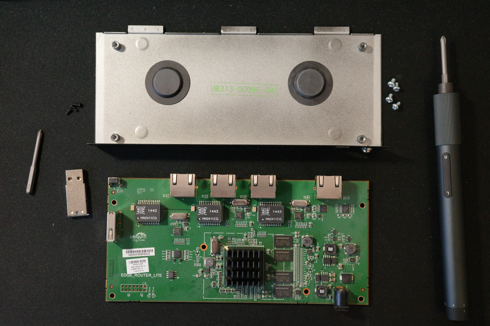
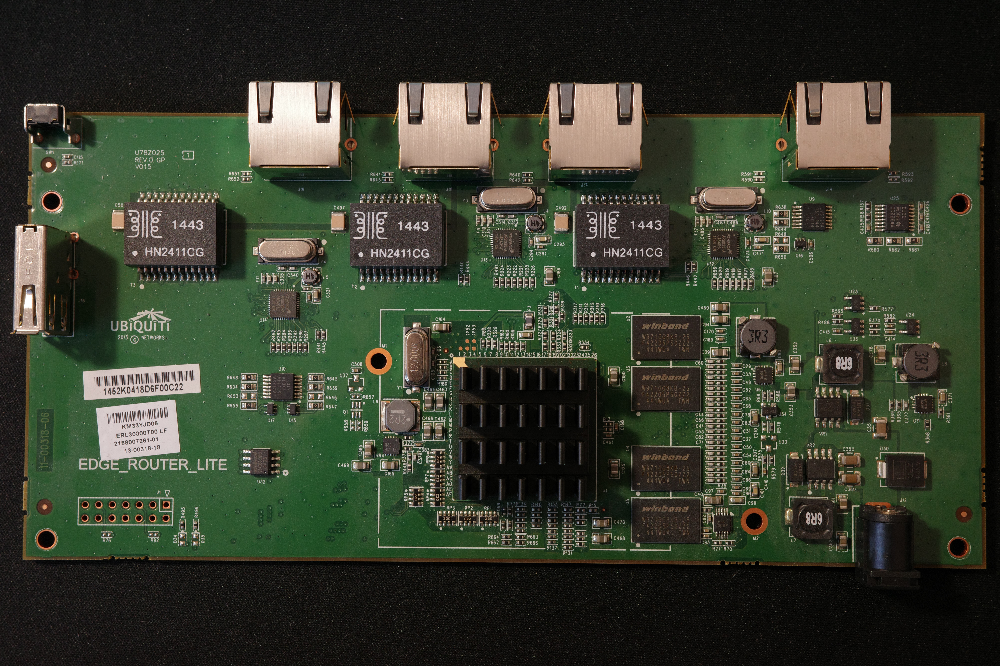
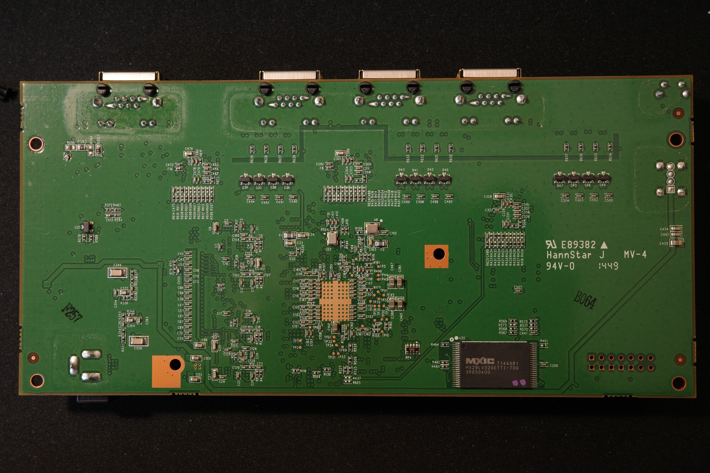

Title: ERLite-3 hardware teardown
Date: 2026-01-18

I received an Ubiquiti EdgeRouter Lite (ERLite-3). I decided to disassemble it.

There are seemingly at least two variants of ERLite-3 enclosures, both contain visually the same PCB.

I have the pleasure of owning a cuboid version of ERLite-3. This version does not have a heatsink plate on the back side.

To disassemble an ERLite-3, you need to remove three black screws in the back of the router (PH0 head) and pull the lid forward, into the direction of the Ethernet ports. The "GROUND" screw does not need to be removed.

Some of the components:

* SoC: Cavium CN5020-500BG564-SCP-G (Octeon, 2-core mips64r2/cnMIPS64)
* SPI-NOR: Winbond 25X05CLNIG (512 Kb)
* Parallel NOR: Macronix MX29LV320ETTI-70G
* USB stick: 13fe:4100 Phison Electronics Corp. Flash drive, USB DISK 2.0 (3.73 GiB, 4009754624 bytes, 7831552 sectors)
* RS-232: TI MA3221C
* 10/100/1000 Mbps RGMII Ethernet PHY: 3x Atheros AR8035-A

There is a [GPL package](https://dl.ui.com/firmwares/edgemax/v3.0.0-rc.9/GPL.octeon.v3.0.0-rc.9.5753459.tar.bz2) available for this device. The URL itself mentions FW version v3.0.0-rc.9, although the latest FW available at the time of writing is [v3.0.1](https://dl.ui.com/firmwares/edgemax/3.0.1/ER-e100.v3.0.1.5862409.tar).

There is also a document floating called [CN50XX-HRM-V0.99E.pdf](https://storage.googleapis.com/google-code-archive-downloads/v2/code.google.com/hactive/CN50XX-HRM-V0.99E.pdf) that could be of interest.

There is a JTAG/EJTAG header, but two pins (would be TDO and nRST, probably?) are disconnected because of missing R76 and R92 resistors. There are also some, presumably, diodes, missing in the vicinity, D34 and D35.

There are five test points near the Cavium that I did not identify.
