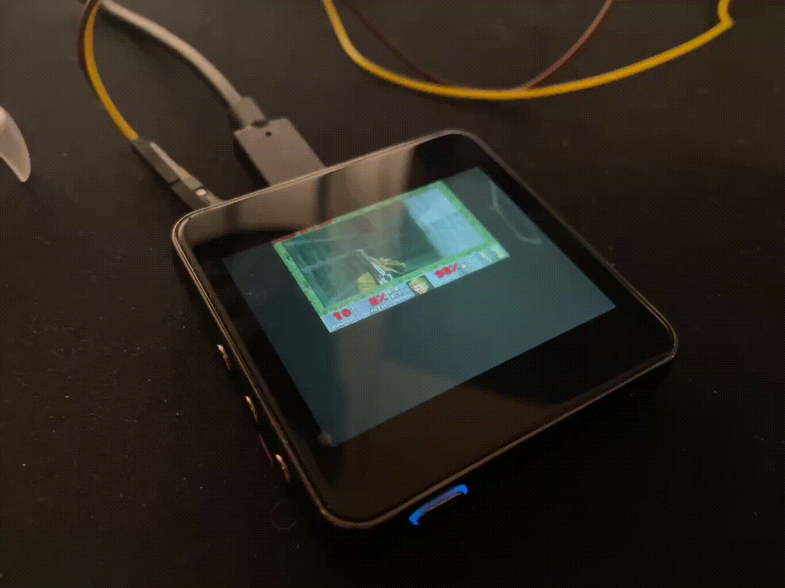
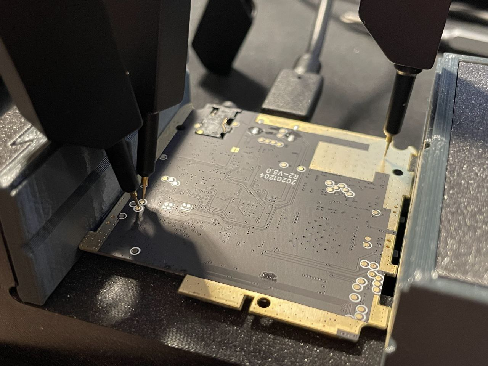

Title: Running Doom on a HiBy R2 player
Date: 2025-01-26

Now that I have a [disassembled player with no battery](/hiby-r2-teardown.html), the only thing left to do is to run Doom on it.

At this point the device powers on without a battery soldered on when the USB cable is connected with a USB-A connector on the other end (so *not* when using USB-C-to-USB-C cables; I first incorrectly assumed the device won't turn on without a battery at all, but it is likely the player just lacks the 5.1k Ohm resistors on the CC pins).



### Boot modes

What if we held some buttons on the device as it is being powered on?

* Vol Up, Next Track, Play/Pause: normal boot.

* Vol Dn: Black screen with "Insert TF Pls" written, no USB device.

* Previous Track: Black screen, Ingenic USB device. Looking this VID:PID up told me that this is a so-called "USB-Boot" mode and it usable with for example an "Ingenic Cloner" program. I have no configuration for the cloner tool, so I left it alone.

    ```
    Bus 001 Device 003: ID a108:1000 Ingenic Semiconductor Co.,Ltd X1000
    ```

### HiBy update files

The vendor's firmware and the instructions are available on the [official support page](https://store.hiby.com/apps/help-center#hc-r2-firmware-v14-update). The firmware download link leads to [Google Drive](https://drive.google.com/drive/folders/1zL_sQsT-umxnWIJK5OLQjJChycokfS9R?usp=share_link).

The instructions say to put the downloaded r2.upt into the root of the SD card. Trying it out, it is flashable when Vol Dn is held. Additionally, if the update process is interrupted midway, the device boots into the "Insert TF Pls" mode automatically.

```
% file r2.upt
r2.upt: ISO 9660 CD-ROM filesystem data 'CDROM'
% isoinfo -i r2.upt -d
CD-ROM is in ISO 9660 format
System id: LINUX
Volume id: CDROM
Volume set id:
Publisher id:
Data preparer id:
Application id: GENISOIMAGE ISO 9660/HFS FILESYSTEM CREATOR (C) 1993 E.YOUNGDALE (C) 1997-2006 J.PEARSON/J.SCHILLING (C) 2006-2007 CDRKIT TEAM
Copyright File id:
Abstract File id:
Bibliographic File id:
Volume set size is: 1
Volume set sequence number is: 1
Logical block size is: 2048
Volume size is: 23984
NO Joliet present
NO Rock Ridge present
```

Mounting the ISO file:

```
% sudo mount -t iso9660 -o loop r2.upt iso_mount_point
% ls iso_mount_point -l
total 47615
-r-xr-xr-x 1 root root        4 Jul 29  2022 _gitigno
-r-xr-xr-x 1 root root 45584384 Nov 24  2022 system.ubi
-r-xr-xr-x 1 root root  3171074 Nov 24  2022 uimage.bin
-r-xr-xr-x 1 root root      260 Nov 24  2022 update.txt
-r-xr-xr-x 1 root root       69 Nov 24  2022 version.txt

% cat version.txt


version={
        name=r2
        ver=2022-11-24T15:39:01+08:00
}

% cat update.txt


kernel={
        name=kernel
        file_path=autoupdate/uimage.bin
        md5=2f046585b38ec5b4f2e3295d9763a5b3
}

rootfs={
        name=rootfs
        full_upgrade=yes
        file_path=autoupdate/system.ubi
        md5=5e0bc3e40c551d121fc692f0988057af
}
```

Looking at the kernel:

```
% file uimage.bin
uimage.bin: u-boot legacy uImage, Linux-3.10.14, Linux/MIPS, OS Kernel Image (gzip), 3171010 bytes, Thu Nov 24 07:38:06 2022, Load Address: 0X80010000, Entry Point: 0X805117A0, Header CRC: 0XA903ABBC, Data CRC: 0X6C6FB073
% binwalk uimage.bin

DECIMAL       HEXADECIMAL     DESCRIPTION
--------------------------------------------------------------------------------
0             0x0             uImage header, header size: 64 bytes, header CRC: 0xA903ABBC, created: 2022-11-24 07:38:06, image size: 3171010 bytes, Data Address: 0x80010000, Entry Point: 0x805117A0, data CRC: 0x6C6FB073, OS: Linux, CPU: MIPS, image type: OS Kernel Image, compression type: gzip, image name: "Linux-3.10.14"
64            0x40            gzip compressed data, maximum compression, from Unix, last modified: 1970-01-01 00:00:00 (null date)
```

Looks like this is only the kernel, no initramfs.

Looking at the rootfs:

```
% file system.ubi
system.ubi: UBIfs image, sequence number 28612, length 4096, CRC 0x7125f312
```

This is a pain to mount. UBIfs can only be used with a NAND device. To mount the image, we need to simulate a NAND flash. [nandsim](http://linux-mtd.infradead.org/faq/nand.html#L_nand_nandsim) is a kernel module that does NAND simulation.

I had to compile in some modules into my WSL2 kernel to support NAND devices. I also had to enable support for the UBIfs compression with LZO.

I fought for some time against the following in my `dmesg`:

```
Hamming ECC initialization failed!
```

Apparently, having Hamming ECC calculation support was not enough, I also needed `CONFIG_MTD_NAND_ECC_SW_HAMMING_SMC` ("Software ECC according to the Smart Media Specification"?!).

My final kernel config change:

```
CONFIG_MTD=m
CONFIG_MTD_UBI=m
CONFIG_MTD_RAW_NAND=m
CONFIG_MTD_NAND_NANDSIM=m
CONFIG_MTD_NAND_ECC=y
CONFIG_MTD_NAND_ECC_SW_HAMMING=y
CONFIG_MTD_NAND_ECC_SW_HAMMING_SMC=y
CONFIG_UBIFS_FS=m
CONFIG_UBIFS_FS_ADVANCED_COMPR=y
CONFIG_UBIFS_FS_LZO=y
CONFIG_UBIFS_FS_ZLIB=n
CONFIG_UBIFS_FS_ZSTD=n
```

The system.ubi file is of size 44M, so I simulate a 64M NAND flash.

Mounting:

```
modprobe lzo
modprobe ubi
modprobe ubifs
modprobe nandsim first_id_byte=0xec second_id_byte=0xa1 third_id_byte=0x00 fourth_id_byte=0x15 # 128MiB, 2048 bytes page;
flash_erase /dev/mtd0 0 0
ubiformat /dev/mtd0 -s 2048 -O 2048
ubiattach -m 0 -d 0 -O 2048
ubimkvol /dev/ubi0 -N hiby -s 64MiB
ubiupdatevol /dev/ubi0_0 system.ubi
mount /dev/ubi0_0 ubifs_mount_point
```

Will it flash if I change something in the UBIfs and update the md5sum in `update.txt`? For example, if I enable the ADB service (how convenient) to start on boot?

```
ubifs_mount_point/etc/init.d$ sudo cp K90adb S90adb
```

Creating the image:

```
$ sudo mkfs.ubifs -v -m 2048 -e 126976 -c 1024 -r ubifs_mount_point new_ubifs.img

# ... <creating a new_iso_image folder, changing the md5sum in update.txt> ...

$ genisoimage -o r2.upt new_iso_image
```

It flashes fine. Lucky.

### Exploring

```
/ # uname -a
Linux buildroot 3.10.14 #1 PREEMPT Thu Nov 24 15:38:05 CST 2022 mips GNU/Linux

/ # cat /proc/cpuinfo
system type             : r2
machine                 : Unknown
processor               : 0
cpu model               : Ingenic Xburst V4.15  FPU V0.0
BogoMIPS                : 1001.88
wait instruction        : yes
microsecond timers      : no
tlb_entries             : 32
extra interrupt vector  : yes
hardware watchpoint     : yes, count: 1, address/irw mask: [0x0fff]
isa                     : mips32r1
ASEs implemented        :
shadow register sets    : 1
kscratch registers      : 0
core                    : 0
VCED exceptions         : not available
VCEI exceptions         : not available

Hardware                : r2
Serial                  : 00000000 00000000 00000000 00000000

/ # cat /proc/mtdinfo
dev:    size   erasesize  name
mtd0: 00080000 00020000 "uboot"
mtd1: 00280000 00020000 "logo"
mtd2: 00600000 00020000 "kernel"
mtd3: 00700000 00020000 "recovery"
mtd4: 04000000 00020000 "rootfs"
mtd5: 03000000 00020000 "data"

# free -b
             total       used       free     shared    buffers     cached
Mem:      59314176   46915584   12398592          0      90112   22974464
-/+ buffers/cache:   23851008   35463168
Swap:            0          0          0
#
```

Only 60Mbytes of RAM...

There is no `/proc/config.gz`.

The `/dev/mtd*` devices are `adb pull`-able.

Looks like there is some sort of NAND protection business going on, because the "uboot" partition only contains the U-Boot SPL and not the U-Boot proper.

The "recovery" partition has another, different kernel, and no initramfs again.

```
recovery.bin: u-boot legacy uImage, Linux-3.10.14, Linux/MIPS, OS Kernel Image (gzip), 4262217 bytes, Thu Jul  9 07:47:34 2020, Load Address: 0X80010000, Entry Point: 0X80542880, Header CRC: 0X6025261B, Data CRC: 0X7B476B3D
```

(compare with the "kernel" kernel: `Thu Jul  9 07:47:34 2020` vs `Thu Nov 24 07:38:06 2022`)

Comparing the output of `strings` on these kernels I concluded that the "recovery" kernel supports ISO images (makes sense) when the "kernel" kernel does not. On the other hand, the "recovery" kernel lacks support for a lot of audio-related things.

Just for future convenience I decided to find if there is a serial console hidden among the abundance of test points on the back side of the main PCB. And there is one, 8n1 115200:



```
\xFF\xFC
U-Boot SPL 2013.07 (Apr 30 2021 - 17:39:50)
ddr autosr:1
apll = 1008000000
 mpll = 600000000
cpccr = 9a052210


U-Boot 2013.07 (Apr 30 2021 - 17:39:50)

Board: R2 (Ingenic XBurst X1000 SoC)
DRAM:  64 MiB
Top of RAM usable for U-Boot at: 84000000
Reserving 0k for U-Boot at: 83f56000
Reserving 518k for U-Boot at: 83ed4000
Reserving 8320k for malloc() at: 836b4000
Reserving 32 Bytes for Board Info at: 836b3fe0
Reserving 128 Bytes for Global Data at: 836b3f60
Reserving 128k for boot params() at: 83693f60
Stack Pointer at: 83693f48
Now running in RAM - U-Boot at: 83ed4000
i2c probe:0, addr:34
NAND:  0 MiB
id0=9b
id1=12
SFC_DEV_STA_RT=0x00000000,
sfcnand param num=9
read status 0xa0 : 0
read status 0xb0 : 1
MMC:

NAND read: device 0 offset 0xc0000, size 0x20000
 131072 bytes read: OK

NAND read: device 0 offset 0xe0000, size 0x20000
 131072 bytes read: OK
*** Warning - bad CRC, using default environment

        *** lcd res: 360*480
pixel_clock = 1728000
power up ldo4
draw logo

NAND read: device 0 offset 0x80000, size 0xa8c00
 691200 bytes read: OK

NAND read: device 0 offset 0x2c0000, size 0xc
 12 bytes read: OK
Mod:   Normal boot mode.
ddr 64m kernel args en
Hit any key to stop autoboot:  0
set KERNEL WATCHDOG SIGNATURE

NAND read: device 0 offset 0x300000, size 0x400000
 4194304 bytes read: OK
## Booting kernel from Legacy Image at 80600000 ...
   Image Name:   Linux-3.10.14
   Image Type:   MIPS Linux Kernel Image (gzip compressed)
   Data Size:    3171010 Bytes = 3 MiB
   Load Address: 80010000
   Entry Point:  805117a0
   Verifying Checksum ... OK
   Uncompressing Kernel Image ... OK

Starting kernel ...

[    0.000000] Initializing cgroup subsys cpuset
[    0.000000] Initializing cgroup subsys cpu
[    0.000000] Initializing cgroup subsys cpuacct
[    0.000000] Linux version 3.10.14 (fkp@Android-Server) (gcc version 4.7.2 (Ingenic 2015.02) ) #1 PREEMPT Thu Nov 24 15:38:05 CST 2022
[    0.000000] bootconsole [early0] enabled
...
```

It gave me a Linux console prompt as well.

U-Boot proper says "Hit any key to stop autoboot", but no matter how many times I tried, it did not accept my input on the serial.

### Modifying

I found an [official Ingenic source code package](https://en.ingenic.com.cn/news-detail/nid-310.html) linked on the Ingenic website that matched my kernel version. It has a toolchain for the X1000 processor, but also a U-Boot tree and a kernel tree for the Ingenic reference platforms, some documentation in Chinese, a prebuilt qemu-system-mipsel, the Ingenic Cloner tool binary, and even a Buildroot tree.

I probably could have used the latest master Buildroot and used a Buildroot toolchain for an "Ingenic XBurst" processor, but using an official toolchain felt nicer.

After a lot of fiddling and twiddling with the Ingenic Buildroot I managed to build some minimal rootfs for the player.

But I did not want to flash, and reflash, and use the system on the NAND chip. The ATO25D1GA chip is rated for "100K Program/Erase Cycles", and while I do not plan on re-flashing the NAND 100k times, I still wanted to make sure that if my system wrote to the drive during runtime, it is not writing to a NAND.

The rather short [X1000/X1000E datasheet](https://en.ingenic.com.cn/static/jext/web/file/download/download.php?path=/file/upload//2024-01/10/202401101555331514.pdf&name=X1000/X1000E%20Data%20Sheet&ext=) does mention that the chip could boot in several modes; "Boot from SFC0" (the NAND), "Boot from MSC0" (the SD card), "Boot from USB 2.0 device" (I assume this is the Ingenic USB-Boot mode). I could not find information about what data format is needed for booting from MSC0, and I was also not sure if the player's PCB would allow to change the value on the BOOT_SEL1 pin.

But since I can control the rootfs on NAND, I can mount the SD card filesystem from `init` and `pivot_root` to it. But I can not have a rootfs on an ExFAT. I needed something like an Ext4.

Sadly, the player's kernel does not have Ext4 support. In fact, looking through the `strings` of that kernel, it only supports ubifs, NTFS, and FAT. Same for the "recovery" kernel with an addition of iso9660.

But it also has FUSE support! Because this player also supports exFAT, and on kernels before v5.4 it is only possible to mount exFAT using FUSE. So I built `fuse2fs` using Buildroot.

The glibc version in this buildroot was different, it was a newer one. So I pushed the whole "package" to the NAND:

```
adb push output/target/sbin/fuse2fs /
adb push output/target/usr/lib/libext2fs.so.2.4 /lib/libext2fs.so.2
adb push output/target/usr/lib/libcom_err.so.2.1 /lib/libcom_err.so.2
adb push output/target/usr/lib/libfuse.so.2.9.7 /lib/libfuse.so.2
adb push output/target/lib/libblkid.so.1.1.0 /lib/libblkid.so.1
adb push output/target/lib/libuuid.so.1.3.0 /lib/libuuid.so.1
adb push output/target/lib/libc-2.22.so /lib/
adb push output/target/lib/libm-2.22.so /lib/
adb push output/target/lib/libdl-2.22.so /lib/
adb push output/target/lib/libpthread-2.22.so /lib/
adb push output/target/lib/ld-2.22.so /lib/
```

I got very lazy with not wanting to mess with several SD cards, so I partitioned my SD card; the first partition is still exFAT, in case I brick the main system on the player and have to reflash the entire ubifs again (that happened several times...); the second partition is now the ext4 system I built with buildroot.

I modified the /init script on the player like so:

```
#!/bin/sh
/bin/mount -t tmpfs tmpfs /dev

if [ ! -e /dev/mmcblk0p2 ]; then
mknod /dev/mmcblk0p2 b 179 2
mknod /dev/null c 1 3
mknod /dev/urandom c 1 9
mknod /dev/fuse c 10 229
fi

mkdir -p /p2
LD_PRELOAD=/lib/libc-2.22.so:/lib/libpthread-2.22.so /lib/ld-2.22.so /fuse2fs /dev/mmcblk0p2 /p2 && cd /p2 && /bin/mount -t tmpfs tmpfs /p2/dev || /bin/sh
mkdir -p /p2/old_fs
pivot_root . old_fs
mknod /dev/console c 5 1
exec chroot . /bin/sh -c 'exec /linuxrc' < /dev/console > /dev/console 2>&1
```

The `|| /bin/sh` part made sure I at least got a recovery console on the UART in case the SD card isn't mountable, for example.

This setup meant that the filesystem that is on NAND is used during boot and also stays mounted. It can not just be unmounted, because it is in use, the fuse2fs and accompanying libraries are stored there and mmaped from there. I thought about copying them into a tmpfs and executing them from tmpfs, but there is already a shortage of RAM on the device, so I did not bother further. But I suspect that for this reason the device does not do `shutdown` or `reboot` nicely.

I liked the idea of having adb to the player, so I enabled the adbd package in Buildroot and sang the song of ADB in an init script:

```
cd /sys/class/android_usb/android0
echo 0 > enable
echo 18d1 > idVendor
echo d002 > idProduct
echo adb > functions
echo 1 > enable
/usr/bin/adbd &
```

### DOOM?

`/dev/fb0` was present, meaning mdev found a framebuffer device. Can it be used?

First I played around with Chocolate DOOM available from Buildroot, but it was very stubborn at startup. Both the game and the configurator really tried to find a console to use as an input device, found none, and exited.

But at least Buildroot downloaded the DOOM demo .wad file, which was convenient.

I found something called [fbDOOM](https://github.com/maximevince/fbDOOM) which was small and looked more hackable. I immediately hacked out the input device setup for now (by commenting out a call to `kbd_init`), to focus on the video part for now.

```
CROSS_COMPILE=/home/line/hiby/x1000-3.10.14-repo/prebuilts/toolchains/mips-gcc520-glibc222/bin/mips-linux-gnu- NOSDL=1 make
```

DOOM started, but was not drawing anything?

I started playing around with the framebuffer device. Something popped up in `dmesg` after I tried to enforce a display mode:

```
# cat /sys/class/graphics/fb0/modes
U:480x360p-60
U:480x360p-0
# echo U:480x360p-0 > /sys/class/graphics/fb0/mode
[   37.128439] wait stable.[223][cgu_lcd]
[   37.390116] pan_display: lcd is disable?
```

So there is some sort of power saving going on?

This was a pickle. I found nothing of the sort in the Ingenic reference repository, neither in the kernel nor anywhere else. HiBy does not publish their open-source archives, so their kernel source was not available. The device does not use kernel modules, everything is built in, so this part of the BSP should have been published...

Anyhow, some time later I found out that a special vendor-specific `ioctl` call is needed to enable the panel.

```
+    /* Enable the display -- SET_SLEEP */
+    ioctl(fd_fb, 0x80044620, &data);
```

I also rewrote the drawing function to use mmap, which seemed to be required, along with another special `ioctl` call to enable DMA:

```
diff --git i/fbdoom/i_video_fbdev.c w/fbdoom/i_video_fbdev.c
index c6e5925..89f9da4 100644
--- i/fbdoom/i_video_fbdev.c
+++ w/fbdoom/i_video_fbdev.c
@@ -48,6 +48,8 @@ rcsid[] = "$Id: i_x.c,v 1.6 1997/02/03 22:45:10 b1 Exp $";
 #include <linux/fb.h>
 #include <sys/ioctl.h>

+#include <sys/mman.h>
+
 //#define CMAP256

 struct fb_var_screeninfo fb = {};
@@ -170,8 +172,14 @@ void I_InitGraphics (void)
         exit(-1);
     }

+    unsigned long long data = 0;
     /* fetch framebuffer info */
     ioctl(fd_fb, FBIOGET_VSCREENINFO, &fb);
+    /* Enable the display -- SET_SLEEP */
+    ioctl(fd_fb, 0x80044620, &data);
+    /* Enable the display -- pan */
+    ioctl(fd_fb, FBIOPAN_DISPLAY, &fb);
+
     /* change params if needed */
     //ioctl(fd_fb, FBIOPUT_VSCREENINFO, &fb);
     printf("I_InitGraphics: framebuffer: x_res: %d, y_res: %d, x_virtual: %d, y_virtual: %d, bpp: %d, grayscale: %d\n",
@@ -198,7 +206,7 @@ void I_InitGraphics (void)

     /* Allocate screen to draw to */
        I_VideoBuffer = (byte*)Z_Malloc (SCREENWIDTH * SCREENHEIGHT, PU_STATIC, NULL);  // For DOOM to draw on
-       I_VideoBuffer_FB = (byte*)malloc(fb.xres * fb.yres * (fb.bits_per_pixel/8));     // For a single write() syscall to fbdev
+       I_VideoBuffer_FB = mmap(NULL, 1384448, PROT_READ|PROT_WRITE, MAP_SHARED, fd_fb, 0);

        screenvisible = true;

@@ -209,7 +217,7 @@ void I_InitGraphics (void)
 void I_ShutdownGraphics (void)
 {
        Z_Free (I_VideoBuffer);
-       free(I_VideoBuffer_FB);
+       munmap(I_VideoBuffer_FB, 1384448);
 }

 void I_StartFrame (void)
@@ -441,9 +449,9 @@ void I_FinishUpdate (void)
         line_in += SCREENWIDTH;
     }

-    /* Start drawing from y-offset */
-    lseek(fd_fb, y_offset * fb.xres, SEEK_SET);
-    write(fd_fb, I_VideoBuffer_FB, (SCREENHEIGHT * fb_scaling * (fb.bits_per_pixel/8)) * fb.xres); /* draw only portion used by doom + x-offsets */
+    // START_DMA: 0x80044661
+    ioctl(fd_fb, 0x80044661, 0);
 }
```

(Note that the above is a patch for GPLv2 code, so it is also GPLv2-licensed then...)

And the graphics were up! I could enjoy the game showcasing the idle demo, without any sound or input.

### Controls

The player has a total of six buttons: a power button, two volume control buttons, as well as a play/pause button, a "next track" button, and a "previous track" button.

Looks like the buttons are visible in the input subsystem:

```
# cat /sys/class/input/*/name
earpods_adc
adc_key
gpio-keys
GT9XX-TS
# cat /sys/class/input/input2/device/keys
114-116,163-165
```

The "GT9XX-TS" device must be the touchscreen.

Testing out `cat /dev/input/event2` and `cat /dev/input/event3` proved that all the buttons and the touchscreen were accessible like that.

Some evdev ioctl-ing later I got the following snippet.

The touchscreen device sends both the coordinates and the "button down"/"button up" events, so I use it as a big Enter key. I use `poll` to monitor both descriptors.

The rest of the buttons are mapped to up, down, left, right, fire, and use (to open doors).

```
static int evd_initted = 0;

static struct pollfd pfds[2];

const static char *keys_input = "/dev/input/event2";
const static char *touch_input = "/dev/input/event3";

int evd_init(void)
{
    memset(&pfds, 0, sizeof(pfds));

    if ((pfds[0].fd = open(keys_input, O_RDONLY)) < 0) {
        printf("Can't open the keys device\n");
        exit(0);
    }
    if ((pfds[1].fd = open(touch_input, O_RDONLY)) < 0) {
        printf("Can't open the touch device\n");
        exit(0);
    }

    pfds[0].events = POLLIN;
    pfds[1].events = POLLIN;
    evd_initted = 1;

    return 0;
}

static void decode_press(unsigned long long input,
                         int type,
                         int code,
                         int value)
{
    event_t event;

    if (input == 0 && type == 1) {
        switch (code) {
        case 114:
            event.data1 = KEY_UPARROW;
            break;
        case 115:
            event.data1 = KEY_DOWNARROW;
            break;
        case 116:
            event.data1 = KEY_USE;
            break;
        case 163:
            event.data1 = KEY_LEFTARROW;
            break;
        case 164:
            event.data1 = KEY_FIRE;
            break;
        case 165:
            event.data1 = KEY_RIGHTARROW;
            break;
        }

        event.data2 = event.data1;
        event.type = (value == 1) ? ev_keydown : ev_keyup;

        D_PostEvent(&event);
    } else if (input == 1 && type == 1 && code == 330) {
        event.data1 = KEY_ENTER;
        event.data2 = event.data1;
        event.type = (value == 1) ? ev_keydown : ev_keyup;

        D_PostEvent(&event);
    }
}

void I_GetEvent(void)
{
    if (evd_initted == 0)
        evd_init();

    int ready = poll(pfds, 2, 0);
    if (ready == -1) return;

    struct input_event ev[64];
    size_t rd;

    /* Deal with array returned by poll(). */
    for (nfds_t j = 0; j < 2; j++) {
        if (pfds[j].revents != 0) {
            if (pfds[j].revents & POLLIN) {
                rd = read(pfds[j].fd, ev, sizeof(ev));

                if (rd < (int) sizeof(struct input_event)) {
                    printf("evtest: short read");
                    continue;
                }

                for (unsigned i = 0;
                     i < (int) (rd / sizeof(struct input_event));
                     i++)
			    {
                    // printf("fd %llu type %d code %d value %d\n", (unsigned long long) j,
                    //        ev[i].type, ev[i].code, ev[i].value);
                    decode_press((unsigned long long) j, ev[i].type,
                                 ev[i].code, ev[i].value);
                }
            } else { /* POLLERR | POLLHUP */
                printf("Error on fd %d\n", pfds[j].fd);
                exit(0);
            }
        }
    }
}
```

It is very responsive and nice to play!

<video controls loop class="illustration">
<source src="hiby-r2-doom-gameplay.webm" type="video/webm" />
</video>

### Audio?

I gave up on audio.

During boot, some devices are found:

```
[    4.948749] ALSA device list:
[    4.951914]   #0: dmic
[    4.954348]   #1: sa_spdif
[    4.957133]   #2: r2
```

By building `aplay` and copying it to the device, I see:

```
# /aplay -l
**** List of PLAYBACK Hardware Devices ****
card 1: saspdif [sa_spdif], device 0: SA SPDIF Dummy spdif dump dai-0 []
  Subdevices: 1/1
  Subdevice #0: subdevice #0
card 2: r2 [r2], device 0: r2-es9218-i2s es9218-hifi-0 []
  Subdevices: 1/1
  Subdevice #0: subdevice #0
# /aplay -L
null
    Discard all samples (playback) or generate zero samples (capture)
default:CARD=saspdif
    sa_spdif,
    Default Audio Device
sysdefault:CARD=saspdif
    sa_spdif,
    Default Audio Device
default:CARD=r2
    r2,
    Default Audio Device
sysdefault:CARD=r2
    r2,
    Default Audio Device
# /amixer -c 2 scontents
Simple mixer control 'DOP_EN',0
  Capabilities: pswitch pswitch-joined
  Playback channels: Mono
  Mono: Playback [off]
Simple mixer control 'Digital Filter',0
  Capabilities: volume volume-joined
  Playback channels: Mono
  Capture channels: Mono
  Limits: 0 - 7
  Mono: 0 [0%]
Simple mixer control 'Hardware Mute',0
  Capabilities: pswitch pswitch-joined
  Playback channels: Mono
  Mono: Playback [off]
Simple mixer control 'Left',0
  Capabilities: pvolume pvolume-joined
  Playback channels: Mono
  Limits: Playback 0 - 255
  Mono: Playback 255 [100%]
Simple mixer control 'Right',0
  Capabilities: pvolume pvolume-joined
  Playback channels: Mono
  Limits: Playback 0 - 255
  Mono: Playback 255 [100%]
Simple mixer control 'isDSD',0
  Capabilities: pswitch pswitch-joined
  Playback channels: Mono
  Mono: Playback [off]
#
```

But twiddling with `amixer` and trying things out with `aplay` and `speaker-test` did not produce any sound on the headphone jack.

I could see something in the kernel logs:

```
[ 3625.601916] jz_i2s_hw_params, rate:48000
[ 3625.651017] ingenic-r2 ingenic-r2: Failed to soft mute 0 (err = -1)
[ 3628.420967] ingenic-r2 ingenic-r2: Failed to soft mute 1 (err = -1)
[ 3628.470969] ingenic-r2 ingenic-r2: Failed to soft mute 0 (err = -1)
[ 3631.260994] ingenic-r2 ingenic-r2: Failed to soft mute 1 (err = -1)
```

### Final bugs

From time to time my device just freezes, sometimes during disk operations, sometimes when it is idle. In those moments I would see `jzmmc` mentions in the serial logs. I don't know how to fix it, I reboot the device every time.

```
[   42.040884] jzmmc_v1.2 jzmmc_v1.2.0: timeout 3000ms op:25 w sz:524288 state:2 STAT:0x1E000580 DMALEN:0x00005800 blks:195/1024 clk:enable clk_gate:enable
```
