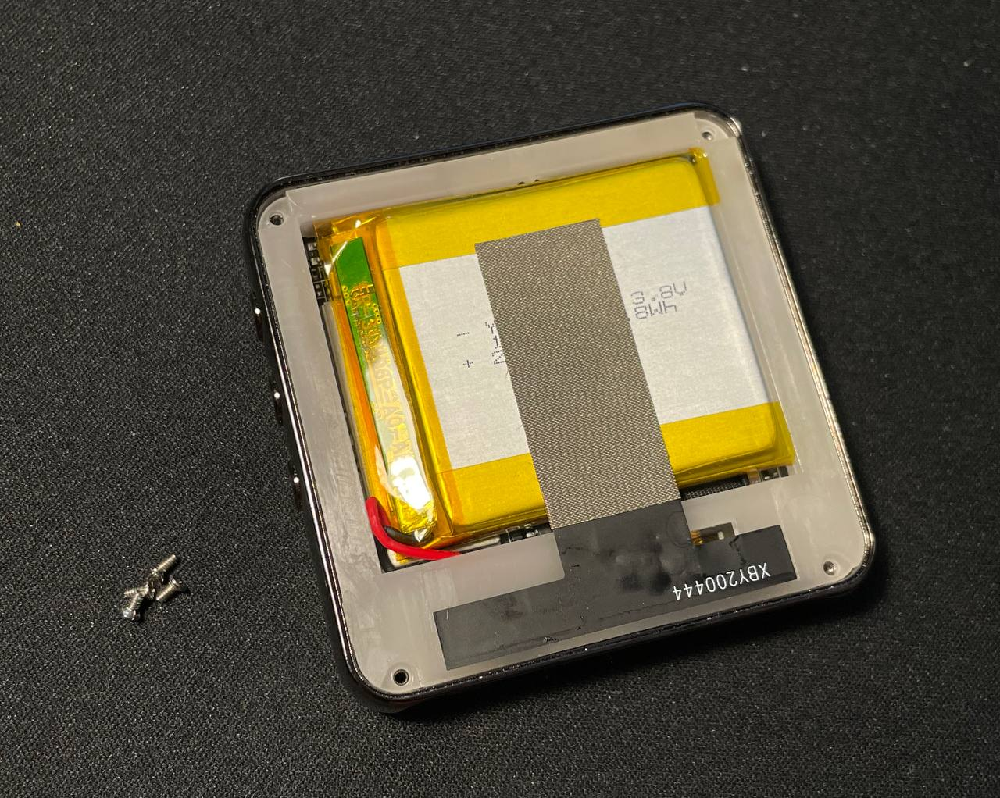
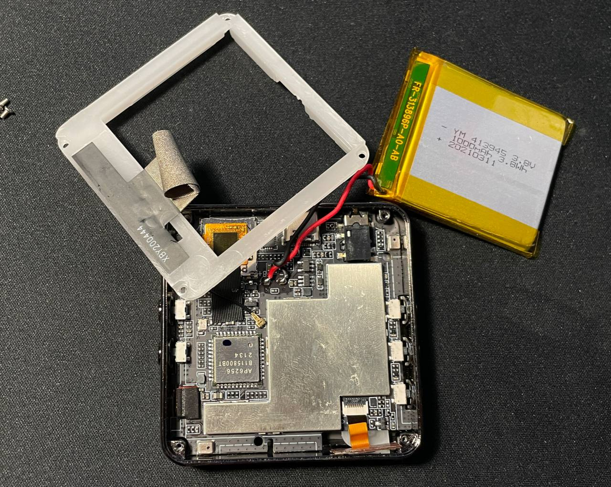
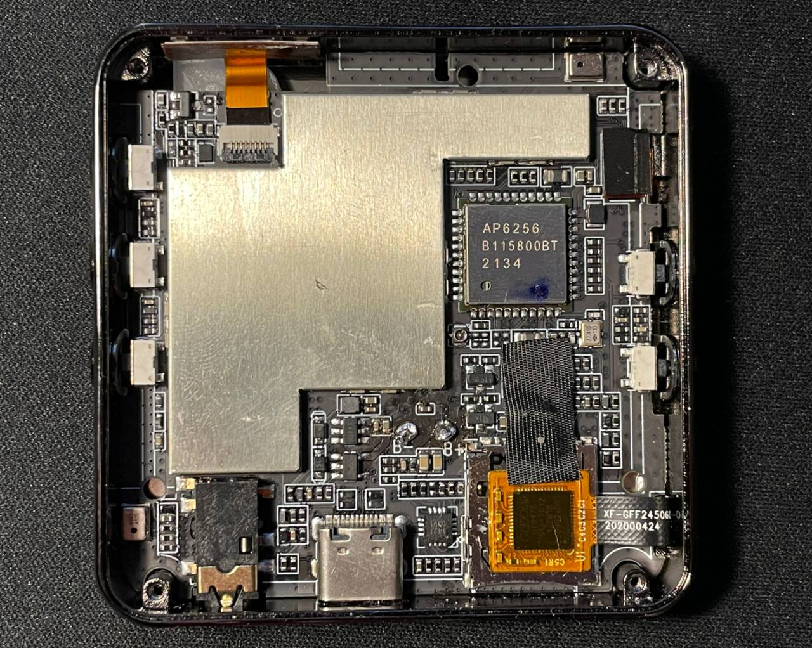
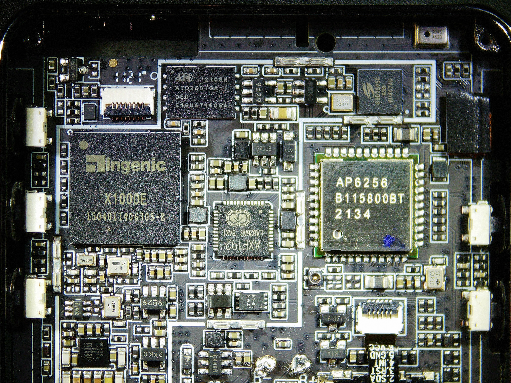
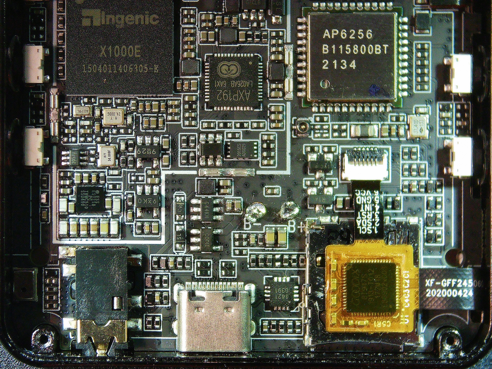
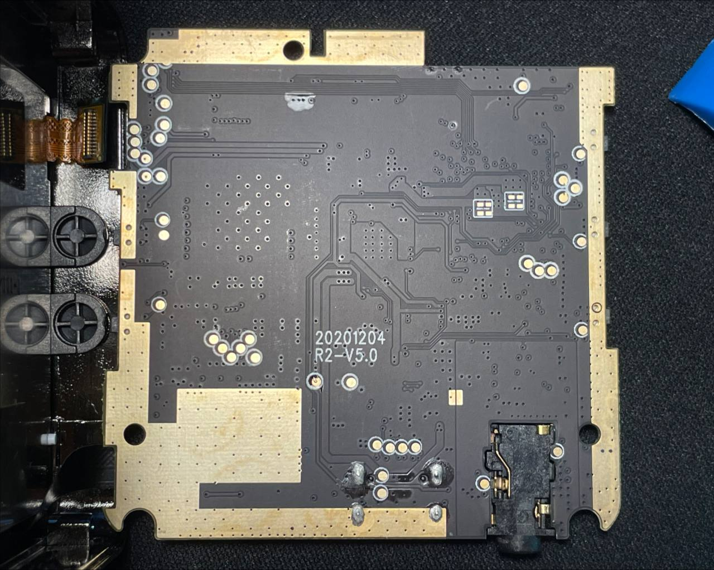
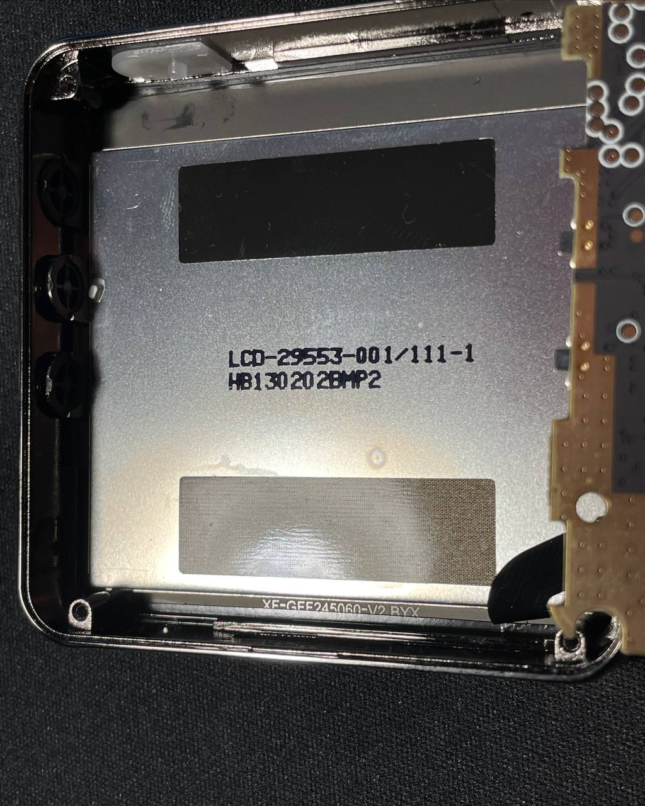

Title: HiBy R2 hardware teardown
Date: 2024-12-18

I received a HiBy R2 player that was "broken; not turning on". Since it was really not turning on even after spending several hours connected to a USB charger, I decided to disassemble it.

To disassemble HiBy R2, you need to apply heat to the back panel (opposite from the display) and pry gently using plastic tools. Be very careful with the glass. Applying both heat and isopropyl alcohol works well; pour some into the slightly-visible gap that appears when you pry. Pay attention to not get any under the display; I accidentally did and now there is a visible stain when the display is on.

Next there are four screws, a plactic bracket that contains an antenna (do not break the cable), and a battery. The battery posed a challenge because it was taped to the shield on the PCB below with a huge piece of double-sided tape. I slowly pried with a "pick"-type plastic tool. This is very dangerous.

I measured the voltage between the battery contacts and it was showing me 2.3V. That is in the "over-discharged" range.

Later on I soldered some leads to the battery contacts on the PCB. Applying 3.8V allowed the player to turn on. This means that: the player can not be powered purely through USB, and the player itself is functioning well. According to the power supply, a powered off player still consumed 0.18A. This explained how the battery got so discharged.

Some of the components:

* SoC: Ingenic X1000E (XBurst 2, mips32r5)
* WiFi, Bluetooth: AMPAK AP6256 (same as seen on some X1000 devboards, like Halley5)
* Display panel: LCD-29553-001/111-1, also known as Samsung SMD LMS245DC08 (same as Blackberry Bold 9790)
* Display panel controller: Solomon Systech SSD2805c (MIPI bridge)
* Touch panel controller: Goodix GT917S (same as PinePhone Pro!)
* Flash: ATO ATO25D1GA, NAND, quad SPI capable
* Power management: AXP192

Pictures:

